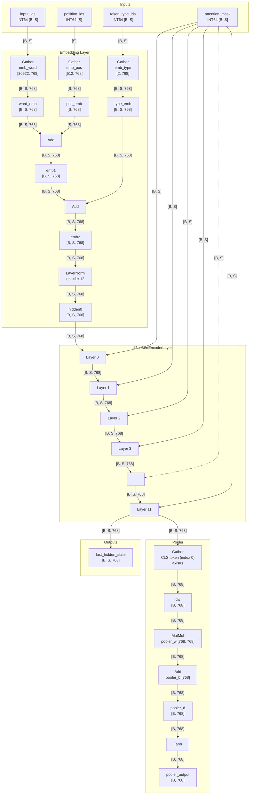
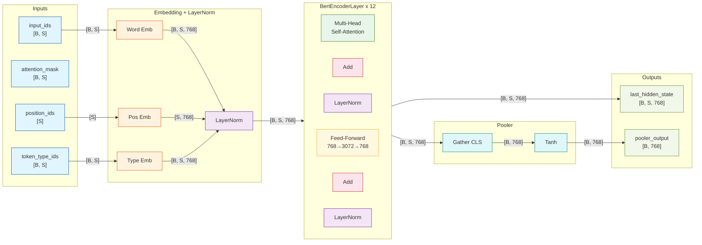

# BERT-Base Model Topology Architecture

> Generated from `build_bert.py` — ONNX model-local function approach, opset 20

## Model Parameters

| Parameter | Value |
|-----------|-------|
| Hidden size (H) | 768 |
| Attention heads | 12 |
| Head dimension | 64 |
| Intermediate size | 3072 |
| Vocabulary size | 30,522 |
| Max position | 512 |
| Token type vocab | 2 |
| Layers | 12 |
| Total params | ~110M |

---

## 1. Main Graph (Top-Level)

---

## 2. Encoder Layer Internals (BertEncoderLayer)

Each encoder layer is an ONNX **model-local function** with 19 positional inputs and 34 internal ops.

```mermaid
flowchart TB
    subgraph EncInputs["Function Inputs"]
        HS["hidden_states<br/>[B, S, 768]"]
        AM["attention_mask<br/>[B, S] int64"]
    end

    subgraph MHA["1. Multi-Head Self-Attention"]
        direction TB

        subgraph QKV["Q/K/V Projections (MatMul + Add)"]
            direction LR
            Q_proj["MatMul + Add<br/>q_w [768,768]<br/>q_b [768]"]
            K_proj["MatMul + Add<br/>k_w [768,768]<br/>k_b [768]"]
            V_proj["MatMul + Add<br/>v_w [768,768]<br/>v_b [768]"]
        end

        subgraph Reshape4D["Reshape + Transpose → [B, 12, S, 64]"]
            direction LR
            Q_t["Q_t [B, 12, S, 64]"]
            K_t["K_t [B, 12, S, 64]"]
            V_t["V_t [B, 12, S, 64]"]
        end

        subgraph AttnCalc["Scaled Dot-Product Attention"]
            direction TB
            KtT["K_tT<br/>Transpose<br/>[B, 12, 64, S]"]
            scores_raw["scores_raw<br/>Q x K^T<br/>[B, 12, S, S]"]
            scale["Mul x 1/sqrt(64)<br/>[B, 12, S, S]"]
            scores["scores<br/>[B, 12, S, S]"]

            mask_f["mask_f<br/>Cast to float<br/>[B, S]"]
            mask_4d["mask_4d<br/>Reshape<br/>[B, 1, 1, S]"]
            mask_inv["mask_inv<br/>1 - mask<br/>[B, 1, 1, S]"]
            mask_add["mask_add<br/>x -10000<br/>[B, 1, 1, S]"]
            scores_masked["scores_masked<br/>[B, 12, S, S]"]
            probs["probs<br/>Softmax<br/>[B, 12, S, S]"]
            ctx_t["ctx_t<br/>probs x V_t<br/>[B, 12, S, 64]"]
            ctx_4d["ctx_4d<br/>Transpose<br/>[B, S, 12, 64]"]
            ctx["ctx<br/>Reshape<br/>[B, S, 768]"]
        end

        subgraph AttnOut["Attention Output Projection"]
            direction TB
            ao_mm["ao_mm<br/>MatMul<br/>ao_w [768,768]<br/>[B, S, 768]"]
            ao["ao<br/>attention_output<br/>[B, S, 768]"]
        end

        HS -->|"[B, S, 768]"| Q_proj
        HS -->|"[B, S, 768]"| K_proj
        HS -->|"[B, S, 768]"| V_proj
        Q_proj -->|"[B, S, 768]"| Q_t
        K_proj -->|"[B, S, 768]"| K_t
        V_proj -->|"[B, S, 768]"| V_t
        Q_t -->|"[B, 12, S, 64]"| scores_raw
        K_t -->|"[B, 12, S, 64]"| KtT
        KtT -->|"[B, 12, 64, S]"| scores_raw
        scores_raw -->|"[B, 12, S, S]"| scale
        scale -->|"[B, 12, S, S]"| scores
        AM -->|"[B, S]"| mask_f
        mask_f -->|"[B, S]"| mask_4d
        mask_4d -->|"[B, 1, 1, S]"| mask_inv
        mask_inv -->|"[B, 1, 1, S]"| mask_add
        scores -->|"[B, 12, S, S]"| scores_masked
        mask_add -->|"[B, 1, 1, S]"| scores_masked
        scores_masked -->|"[B, 12, S, S]"| probs
        probs -->|"[B, 12, S, S]"| ctx_t
        V_t -->|"[B, 12, S, 64]"| ctx_t
        ctx_t -->|"[B, 12, S, 64]"| ctx_4d
        ctx_4d -->|"[B, S, 12, 64]"| ctx
        ctx -->|"[B, S, 768]"| ao_mm
        ao_mm -->|"[B, S, 768]"| ao
    end

    subgraph Res1["2. Residual + LayerNorm 1"]
        res1["res1<br/>Add<br/>hidden_states + attention_output<br/>[B, S, 768]"]
        ln1["norm1<br/>LayerNorm<br/>eps=1e-12<br/>[B, S, 768]"]
    end

    subgraph FFN["3. Feed-Forward Network"]
        direction TB
        fi_mm["fi_mm<br/>MatMul<br/>fi_w [768, 3072]<br/>[B, S, 3072]"]
        fi["fi<br/>Add fi_b [3072]<br/>[B, S, 3072]"]
        gelu["gelu<br/>GELU (tanh approx)<br/>[B, S, 3072]"]
        fo_mm["fo_mm<br/>MatMul<br/>fo_w [3072, 768]<br/>[B, S, 768]"]
        fo["fo<br/>ff_output<br/>[B, S, 768]"]
    end

    subgraph Res2["4. Residual + LayerNorm 2"]
        res2["res2<br/>Add<br/>norm1 + ff_output<br/>[B, S, 768]"]
        ln2["output<br/>LayerNorm<br/>eps=1e-12<br/>[B, S, 768]"]
    end

    HS -->|"[B, S, 768]"| res1
    ao -->|"[B, S, 768]"| res1
    res1 -->|"[B, S, 768]"| ln1
    ln1 -->|"[B, S, 768]"| fi_mm
    fi_mm -->|"[B, S, 3072]"| fi
    fi -->|"[B, S, 3072]"| gelu
    gelu -->|"[B, S, 3072]"| fo_mm
    fo_mm -->|"[B, S, 768]"| fo
    ln1 -->|"[B, S, 768]"| res2
    fo -->|"[B, S, 768]"| res2
    res2 -->|"[B, S, 768]"| ln2
```

---

## 3. Simplified Data Flow (Colored)

---

## 4. Shape Reference Tables

### 4.1 Main Graph Tensors (from ONNX shape inference)

| Tensor | Shape |
|--------|-------|
| `input_ids` | `[B, S]` |
| `attention_mask` | `[B, S]` |
| `token_type_ids` | `[B, S]` |
| `position_ids` | `[S]` |
| `word_emb` | `[B, S, 768]` |
| `pos_emb` | `[S, 768]` |
| `type_emb` | `[B, S, 768]` |
| `emb1` | `[B, S, 768]` |
| `emb2` | `[B, S, 768]` |
| `hidden0` … `hidden12` | `[B, S, 768]` |
| `last_hidden_state` | `[B, S, 768]` |
| `cls` | `[B, 768]` |
| `pooler_mm` | `[B, 768]` |
| `pooler_d` | `[B, 768]` |
| `pooler_output` | `[B, 768]` |

### 4.2 Encoder Layer Internal Tensors

| Stage | Tensor | Shape |
|-------|--------|-------|
| Input | `hidden_states` | `[B, S, 768]` |
| Input | `attention_mask` | `[B, S]` (int64) |
| Q/K/V proj | `Q`, `K`, `V` | `[B, S, 768]` |
| Reshape 4D | `Q_4d`, `K_4d`, `V_4d` | `[B, S, 12, 64]` |
| Transpose | `Q_t`, `K_t`, `V_t` | `[B, 12, S, 64]` |
| K transpose | `K_tT` | `[B, 12, 64, S]` |
| Scores | `scores_raw`, `scores` | `[B, 12, S, S]` |
| Mask | `mask_f` | `[B, S]` (float) |
| Mask | `mask_4d`, `mask_inv`, `mask_add` | `[B, 1, 1, S]` |
| After softmax | `scores_masked`, `probs` | `[B, 12, S, S]` |
| Context | `ctx_t` | `[B, 12, S, 64]` |
| Context | `ctx_4d` | `[B, S, 12, 64]` |
| Context | `ctx` | `[B, S, 768]` |
| Attn output | `ao_mm`, `ao` | `[B, S, 768]` |
| Residual 1 | `res1`, `norm1` | `[B, S, 768]` |
| FF up | `fi_mm`, `fi`, `gelu` | `[B, S, 3072]` |
| FF down | `fo_mm`, `fo` | `[B, S, 768]` |
| Residual 2 | `res2`, `output` | `[B, S, 768]` |

---

## 5. Weight Inventory Per Layer

Each encoder layer `L{l}` has **16 weight tensors**:

| Category | Tensors | Shapes |
|----------|---------|--------|
| Query | `L{l}_q_w`, `L{l}_q_b` | `[768, 768]`, `[768]` |
| Key | `L{l}_k_w`, `L{l}_k_b` | `[768, 768]`, `[768]` |
| Value | `L{l}_v_w`, `L{l}_v_b` | `[768, 768]`, `[768]` |
| Attn Output | `L{l}_ao_w`, `L{l}_ao_b` | `[768, 768]`, `[768]` |
| Attn LayerNorm | `L{l}_aln_w`, `L{l}_aln_b` | `[768]`, `[768]` |
| FF Intermediate | `L{l}_fi_w`, `L{l}_fi_b` | `[768, 3072]`, `[3072]` |
| FF Output | `L{l}_fo_w`, `L{l}_fo_b` | `[3072, 768]`, `[768]` |
| FF LayerNorm | `L{l}_fln_w`, `L{l}_fln_b` | `[768]`, `[768]` |

Shared: `emb_word` `[30522, 768]`, `emb_pos` `[512, 768]`, `emb_type` `[2, 768]`, `emb_ln_w/b` `[768]`, `pooler_w` `[768, 768]`, `pooler_b` `[768]`.

---

## 6. ONNX Graph Statistics

| Metric | Value |
|--------|-------|
| Main-graph ops | 18 (embedding + 12 layer calls + pooler) |
| Function ops (per layer) | 34 |
| Total executed ops | 414 |
| Unique ops | 52 |
| Functions | 1 (`BertEncoderLayer`, reused 12x) |
| IR version | 8 |
| Opset | 20 + bert.model:1 |
